# spotify_app

## 📸 App Screenshots

### 🌑 Dark Mode

  <table border="0">
    <tr>
        <td></td>
        <td></td>
        <td></td>
        <td></td>
        <td></td>
        <td>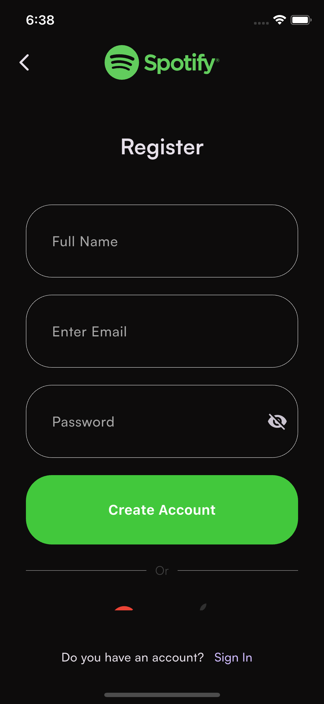</td>
        <td></td>
        <td></td>
        <td></td>
        <td>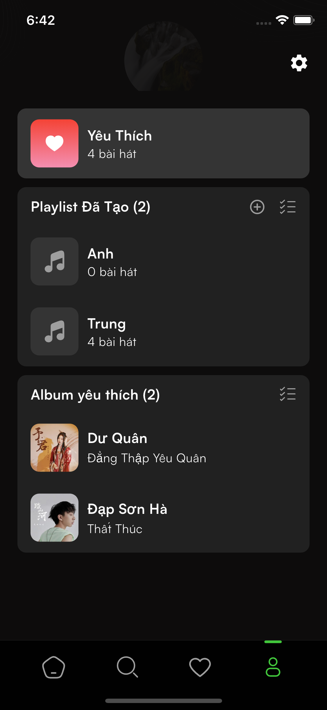</td>
        <td>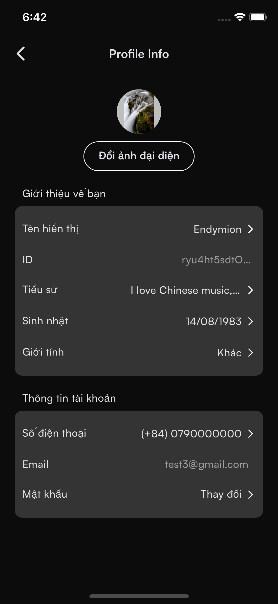</td>
    </tr>
    <tr>
        <td align="center">Splash</td>
        <td align="center">Intro</td>
        <td align="center">Choose Mode</td>
        <td align="center">Sign In And Register</td>
        <td align="center">Sign In</td>
        <td align="center">Register</td>
        <td align="center">Home</td>
        <td align="center">Search</td>
        <td align="center">Artist</td>
        <td align="center">Profile</td>
        <td align="center">Profile Info</td>
    </tr>

  </table>

---

### ☀️ Light Mode

  <table border="0">
    <tr>
        <td></td>
        <td></td>
        <td>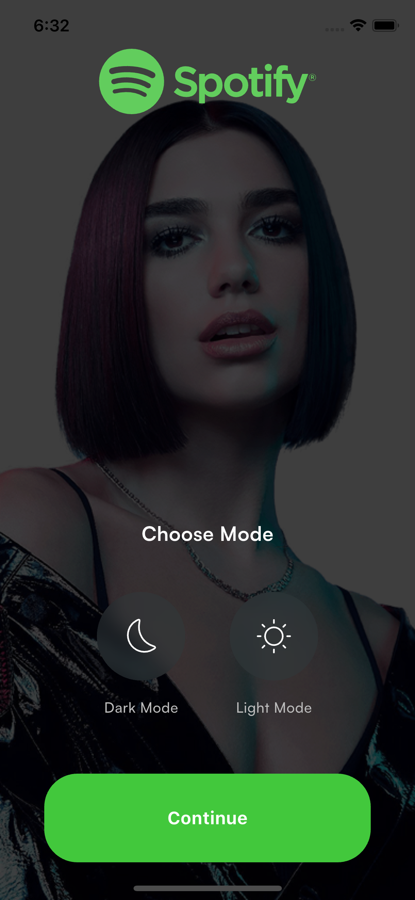</td>
        <td></td>
        <td>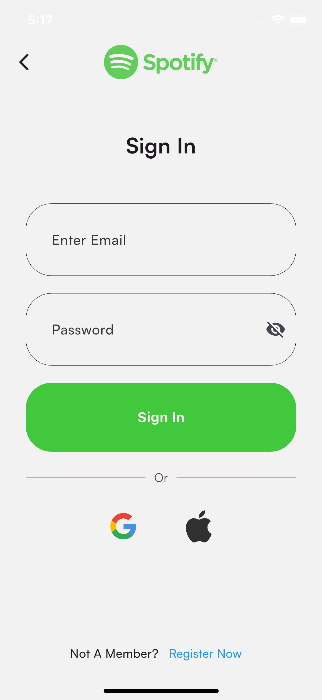</td>
        <td>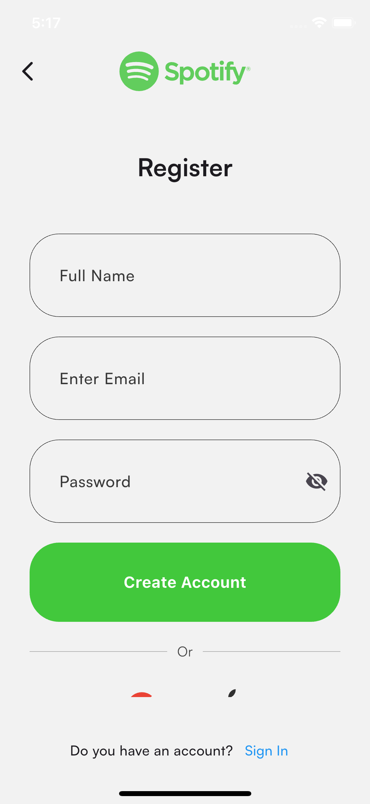</td>
        <td>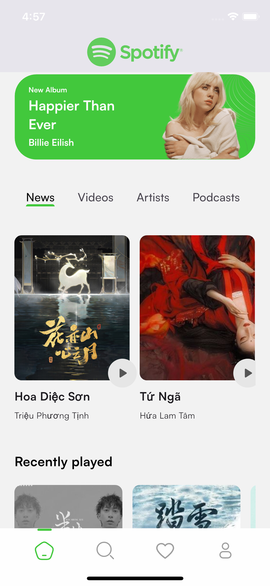</td>
        <td>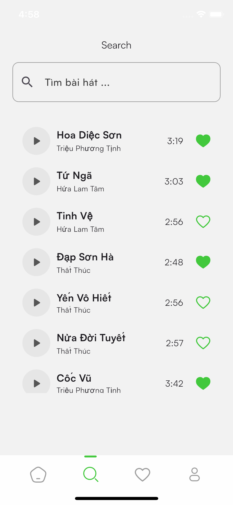</td>
        <td>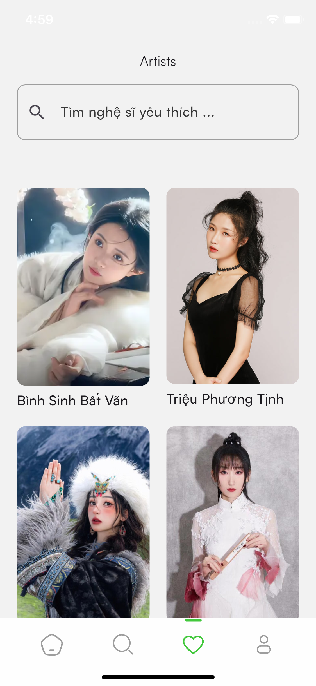</td>
        <td>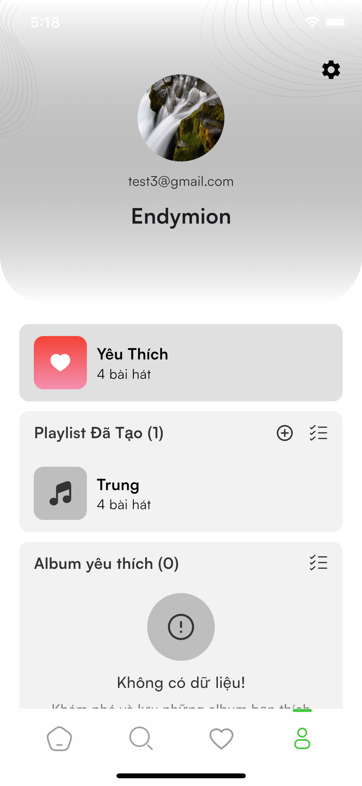</td>
        <td>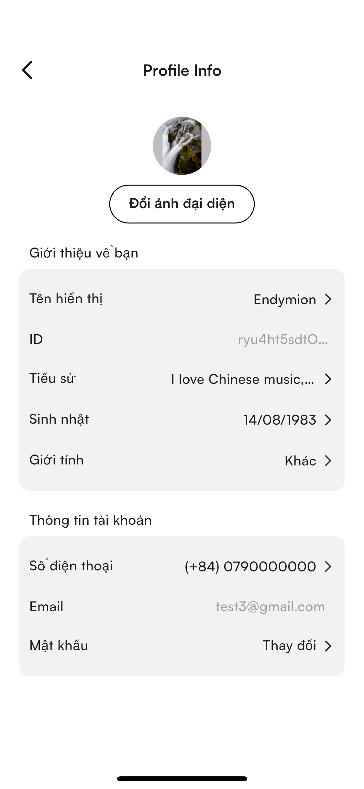</td>
    </tr>
    <tr>
        <td align="center">Splash</td>
        <td align="center">Intro</td>
        <td align="center">Choose Mode</td>
        <td align="center">Sign In And Register</td>
        <td align="center">Sign In</td>
        <td align="center">Register</td>
        <td align="center">Home</td>
        <td align="center">Search</td>
        <td align="center">Artist</td>
        <td align="center">Profile</td>
        <td align="center">Profile Info</td>
    </tr>

  </table>

