# spotify_app
App này được tạo ra chỉ vì sở thích cá nhân là thích tiếng Trung và nghe nhạc Trung Quốc.
App này một phần làm theo youtube, một phần là sử dụng AI để điều chỉnh theo ý của bản thân,
cho nên app vẫn còn một số lỗi nhỏ.
Source được tổ chức theo kiến trúc Clean Architecture, State Management là Cubit (Bloc)

## 📸 App Screenshots

### ☀️ Light Mode

<p align="center">
  <table border="0">
    <tr>
        <td></td>
        <td></td>
        <td></td>
        <td></td>
        <td></td>
    </tr>
    <tr>
        <td align="center">Splash</td>
        <td align="center">Intro</td>
        <td align="center">Choose Mode</td>
        <td align="center">Sign In And Register</td>
        <td align="center">Sign In</td>
    </tr>

  </table>
</p>

<p align="center">
  <table border="0">
    <tr>
        <td></td>
        <td></td>
        <td>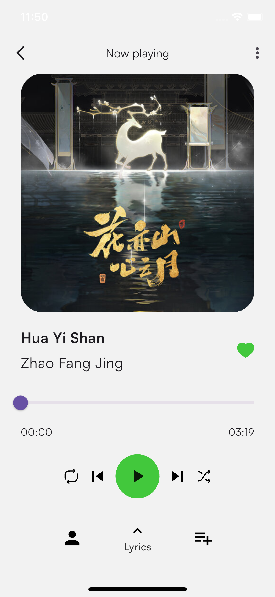</td>
        <td>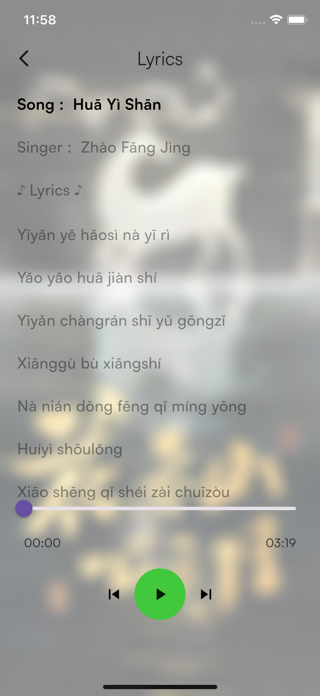</td>
    </tr>
    <tr>
        <td align="center">Register</td>
        <td align="center">Home</td>
        <td align="center">Player</td>
        <td align="center">Lyric</td>
    </tr>

  </table>
</p>

<p align="center">
  <table border="0">
    <tr>
        <td></td>
        <td></td>
        <td></td>
        <td></td>
    </tr>
    <tr>
        <td align="center">Search</td>
        <td align="center">Artist</td>
        <td align="center">Profile</td>
        <td align="center">Profile Info</td>
    </tr>

  </table>
</p>

---

### 🌑 Dark Mode

<p align="center">
  <table border="0">
    <tr>
        <td></td>
        <td></td>
        <td></td>
        <td></td>
        <td></td>
    </tr>
    <tr>
        <td align="center">Splash</td>
        <td align="center">Intro</td>
        <td align="center">Choose Mode</td>
        <td align="center">Sign In And Register</td>
        <td align="center">Sign In</td>
    </tr>

  </table>
</p>

<p align="center">
  <table border="0">
    <tr>
        <td></td>
        <td></td>
        <td></td>
        <td></td>
    </tr>
    <tr>
        <td align="center">Register</td>
        <td align="center">Home</td>
        <td align="center">Player</td>
        <td align="center">Lyric</td>
    </tr>

  </table>
</p>

<p align="center">
  <table border="0">
    <tr>
        <td></td>
        <td></td>
        <td></td>
        <td></td>
    </tr>
    <tr>
        <td align="center">Search</td>
        <td align="center">Artist</td>
        <td align="center">Profile</td>
        <td align="center">Profile Info</td>
    </tr>

  </table>
</p>


## 🚀 Hướng dẫn thiết lập (Setup)

### 1. Cấu hình Firebase
Dự án này sử dụng Firebase cho Authentication và Firestore. Để chạy dự án, bạn cần:

1. Tạo một dự án mới trên [Firebase Console](https://console.firebase.google.com/).
2. Cài đặt **FlutterFire CLI**:
   ```bash
   dart pub global activate flutterfire_cli

3. Cấu hình Firebase cho dự án:
   ```bash
   flutterfire configure
4. Đảm bảo file lib/firebase_options.dart đã được tạo (file này hiện đang được đưa vào .gitignore để bảo mật).
5. Cài đặt Dependencies
   ```bash
   flutter pub get
6. Chạy ứng dụng
   ```bash
   flutter run

### 2. Cấu hình Database
1. Authentication
   ```
   Trên thanh menu bên trái --> Chọn Authentication -->
   Sign-in method --> Add new provider --> Select Email/Password

2. Firestore
  ```
  Tất cả các Collection cần phải tạo
<p align="center">
  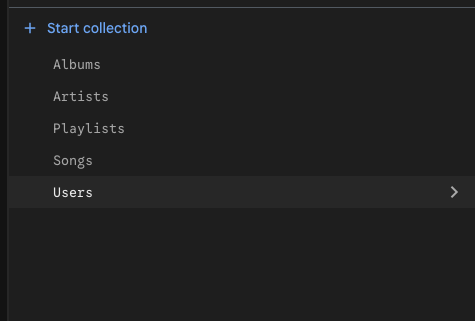
</p>
  ```
  Collection User:
    - Sẽ tự động tạo khi đăng ký 
    - Bên trong mỗi user sẽ có 3 subcollection 
      * Favorites : tự động tạo khi nhất nút thích bài hát trong app
      * FavoriteAlbums : sẽ tự động tạo khi nhất thích album trong app
      * RecentlyPlayed : sẽ tự động tạo khi nhấn vào nghe một bài hát bất kỳ
<p align="center">
  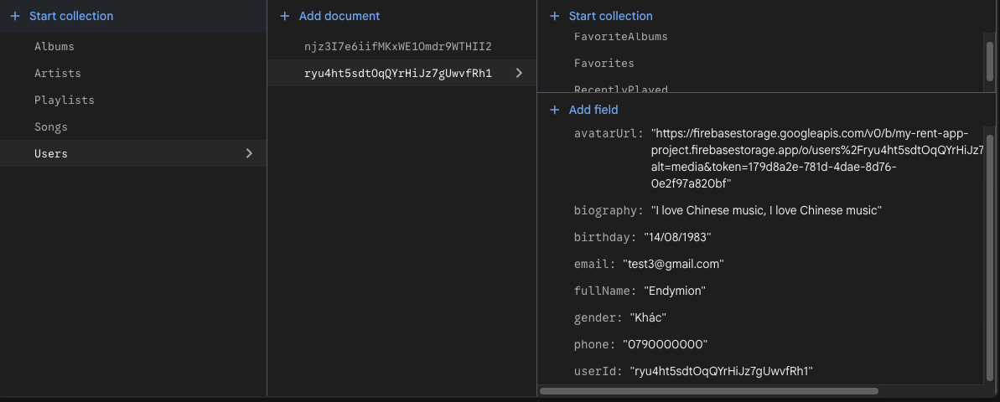
</p>
  ```
  Collection Playlists:
    - Sẽ tự động tạo khi tạo một playlist trong app
<p align="center">
  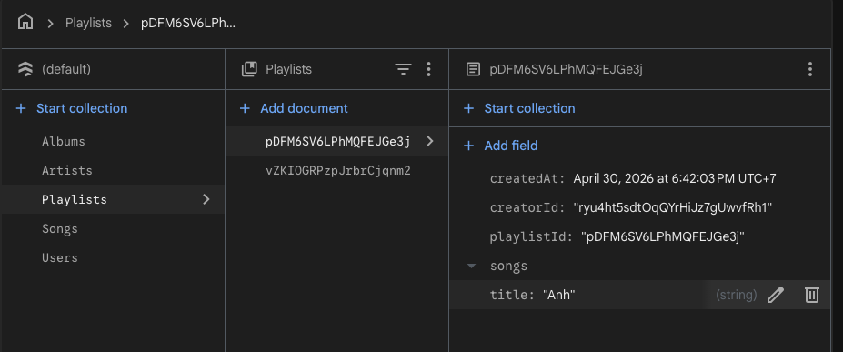
</p>
  ```
  Collection Artists:
    - Phải tự nhập thông tin
<p align="center">
  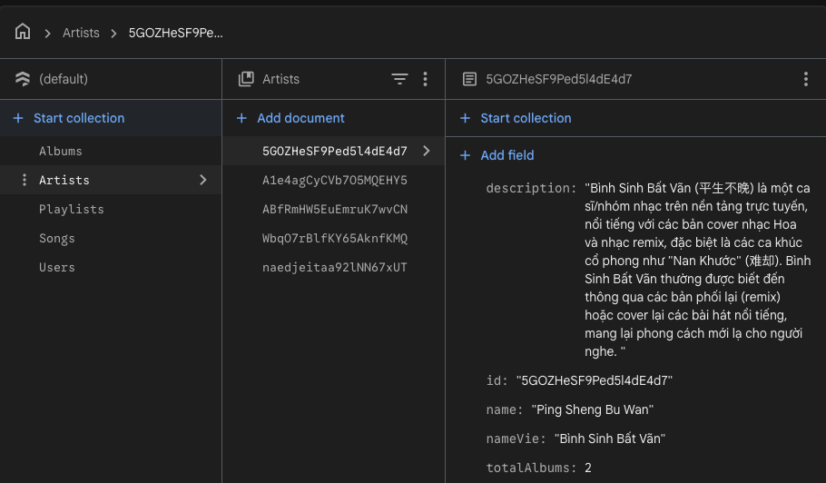
</p>
  ```
  Collection Albums:
    = Phải tự nhập thông tin
<p align="center">
  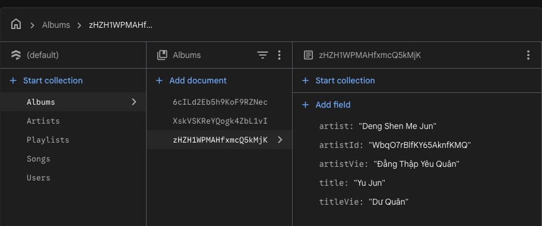
</p>
  ```
  Collection Songs:
    = Phải tự nhập thông tin (Khá nhiều và rất lâu)
<p align="center">
  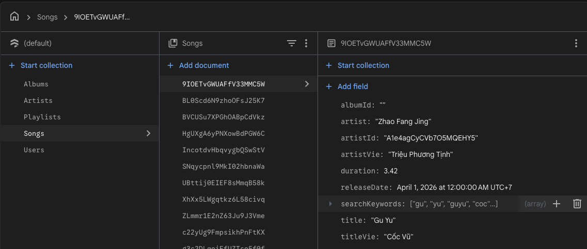
</p>


3. Storage
  ```
  Tất cả các Storage cần phải tạo
<p align="center">
  
</p>
  ```
  Mở tab Rules để thiết lập một số quyền hạn
<p align="center">
  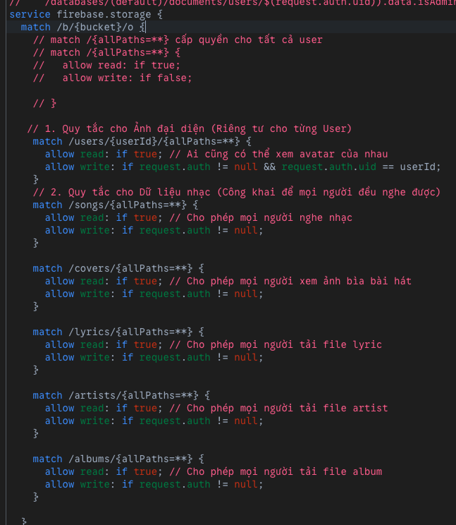
</p>
  ```
  Storage users:
    - Tạo trước một folder rỗng 
    - Dùng để chứa avatar của mỗi user khi đổi avater trong app
<p align="center">
  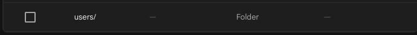
</p>
  ```
  Storage artists:
    - Phải tự thêm dữ liệu
    - Tên hình ảnh phải giống với field "artist" của Songs 
<p align="center">
  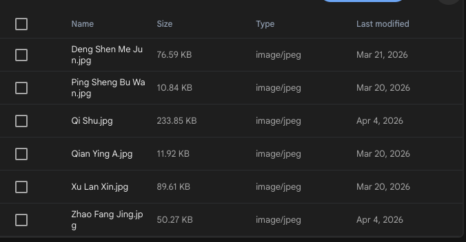
</p>
  ```
  Storage albums:
    - Phải tự thêm dữ liệu
    - Tên album phải giống với field "title" của Albums 
<p align="center">
  
</p>
  ```
  Storage covers:
    - Phải tự thêm dữ liệu
    - Tên cover phải đạt theo cấu trúc [artist] - [title].jpg tương ứng với các field trong Songs 
<p align="center">
  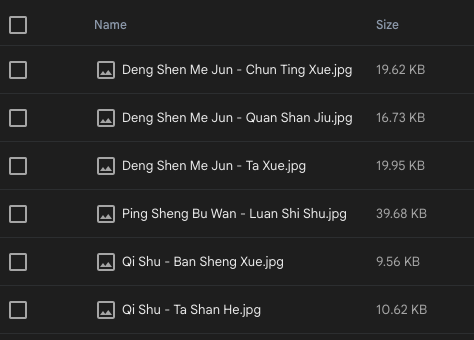
</p>
  ```
  Storage lyrics:
    - Phải tự thêm dữ liệu
    - Tên lyric phải đạt theo cấu trúc [artist] - [title].lrc.txt tương ứng với các field trong Songs 
  
  Bạn muốn tạo file lrc thì dùng [LRC Generator](https://lrcgenerator.com/#google_vignette)
<p align="center">
  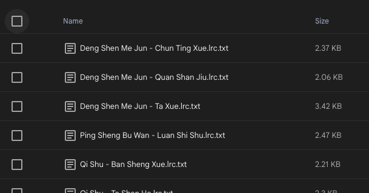
</p>
  ```
  Storage songs:
    - Phải tự thêm dữ liệu
    - Tên song phải đạt theo cấu trúc [artist] - [title].mp3 tương ứng với các field trong Songs 
<p align="center">
  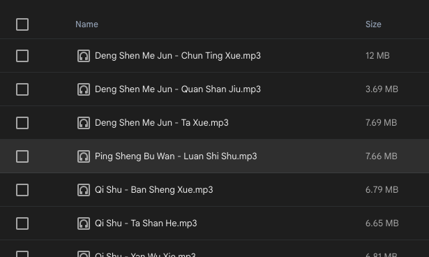
</p>